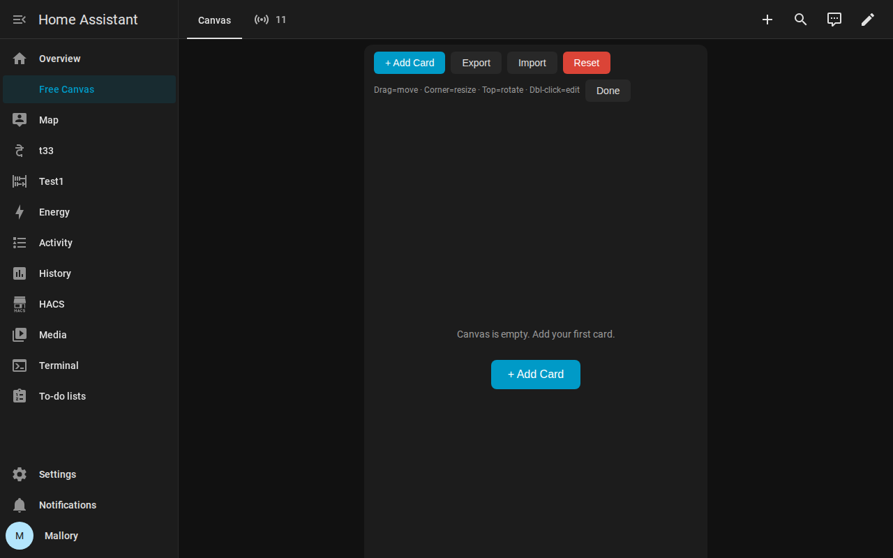

# Free Canvas Card for Home Assistant

A freeform canvas Lovelace card. Place any HA cards on it at arbitrary
positions — **no grid, no snap**. Drag to move, corner handle to resize,
top handle to **rotate** by any angle. Layout persists to `localStorage`.



## Features

- **Free positioning** — absolute x/y coordinates, no grid or snap
- **Drag** — move cards anywhere on the canvas
- **Resize** — bottom-right handle, min 80×60px
- **Rotate** — top handle, arbitrary angle (0–360°), hold **Shift** to snap to 15° increments
- **Z-order** — click to select, selected card stays on top
- **Smart card picker** — choose from built-in and custom cards, pick entities, preview before placing
- **Per-card configurator** — entity dropdown, title, hours, chart type, etc.
- **Raw JSON toggle** — edit the generated config directly for advanced cases
- **Export / Import** — save and restore layouts as JSON files
- **Auto-save** — layout persists to `localStorage` per `storage_key`
- **Any Lovelace card** — entities, gauge, mushroom, weather-radar, picture, etc.
- **Zero dependencies** — vanilla JS, no Lit, no bundler, no npm

## Installation

### Method 1: HACS (recommended)

1. In HACS, add a custom repository:
   - URL: `https://github.com/mallory303/free-canvas-card`
   - Type: **Dashboard**
2. Search for "Free Canvas Card" and download it
3. The resource is registered automatically

### Method 2: Manual

1. Download [`free-canvas-card.js`](free-canvas-card.js)
2. Copy to your HA `www/` directory:
   ```bash
   scp free-canvas-card.js homeassistant:/config/www/free-canvas-card.js
   ```
3. Add as a Lovelace resource (Settings → Dashboards → Resources):
   ```yaml
   url: /local/free-canvas-card.js
   type: module
   ```
4. Hard refresh your browser (`Ctrl+Shift+R`)

## Usage

Add the card to any dashboard (YAML or visual editor):

```yaml
type: custom:free-canvas-card
storage_key: my_dashboard   # unique key for this canvas layout
height: 700                  # canvas height in pixels (default: 500)
```

### Adding cards

1. Click the **✎ pencil** icon (top-right) to enter edit mode
2. Click **+ Add Card** to open the smart picker
3. Search or scroll to find the card type you want
4. Configure the card in the dialog:
   - Pick an entity from a filtered dropdown
   - Set title, hours, chart type, etc. when applicable
   - A live preview shows the result before you place it
   - Open **View generated JSON** to edit raw config
5. Click **Add Card**

If no suitable entity exists in your Home Assistant instance for a card
that requires one (e.g. **Thermostat** needs a `climate` entity,
**Media Control** needs a `media_player`), the configurator will warn
you and the card will likely show a configuration error when placed.

### Moving, resizing, rotating

| Action | How |
|--------|-----|
| Move | Drag the card body |
| Resize | Drag the bottom-right handle (⤡) |
| Rotate | Drag the top handle (⟳) — hold Shift for 15° snap |
| Edit config | Click the top-left handle (⚙) or double-click the card |
| Delete | Click the top-right handle (✕) |
| Deselect | Click empty canvas area |

Click **Done** to exit edit mode. Layout auto-saves on every change.

### Export / Import

- **Export** — downloads a JSON file with the full layout
- **Import** — uploads a JSON file to replace the current layout
- **Reset** — clears all cards (confirm required)

## Configuration

| Key | Type | Default | Description |
|-----|------|---------|-------------|
| `storage_key` | string | `"default"` | Unique key for layout persistence (per-canvas) |
| `height` | number | `500` | Canvas height in pixels |
| `cards` | array | `[]` | Pre-seed cards (each: `{x, y, w, h, rotation, card}`) |

## Compatibility

- Home Assistant 2024.x and later
- Works in storage-mode dashboards
- No HACS dependency (but HACS install is supported)

## Known limitations

- The card cannot invoke Home Assistant's native card editor/picker dialogs.
  HA's editor lives in private webpack/rspack chunks that external custom
  cards cannot register, so this card uses its own picker and configurator.
- Cards that require an entity domain you don't have (e.g. climate, media_player)
  will show a configuration error unless a compatible entity is configured.

## License

MIT — see [LICENSE](LICENSE)
